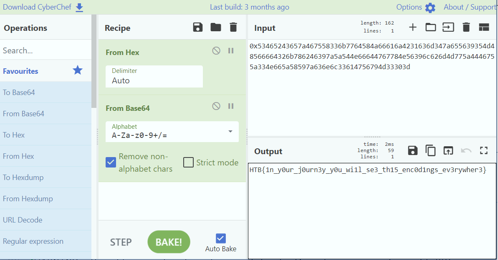

# Crypto

## Ancient Encodings

Read source.py - `hex(bytes_to_long(b64encode(message)))`

[CyberChef](https://gchq.github.io/CyberChef/) is great for this:

> HTB{1n_y0ur_j0urn3y_y0u_wi1l_se3_th15_enc0d1ngs_ev3rywher3}

## Small StEps

Textbook RSA with e=3

## Perfect Synchronization

TODO: mention quipqiup
