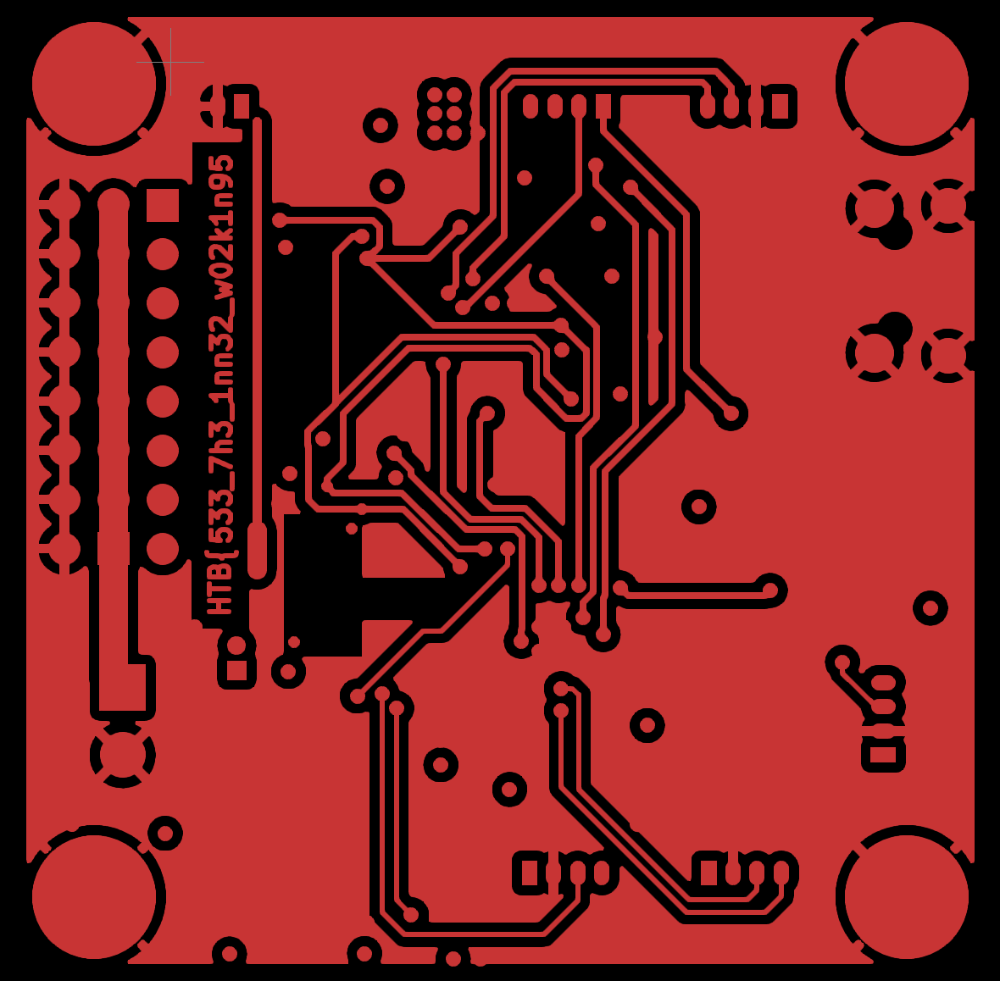
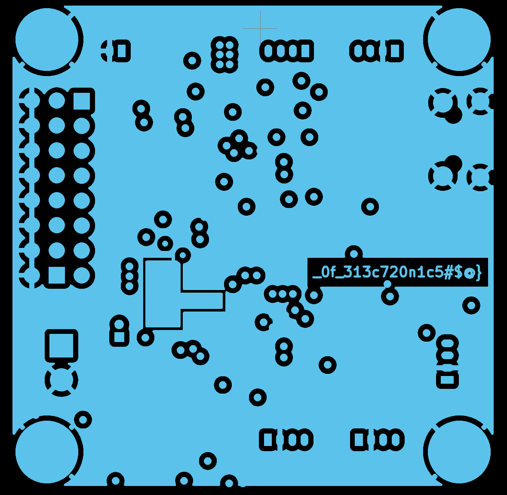
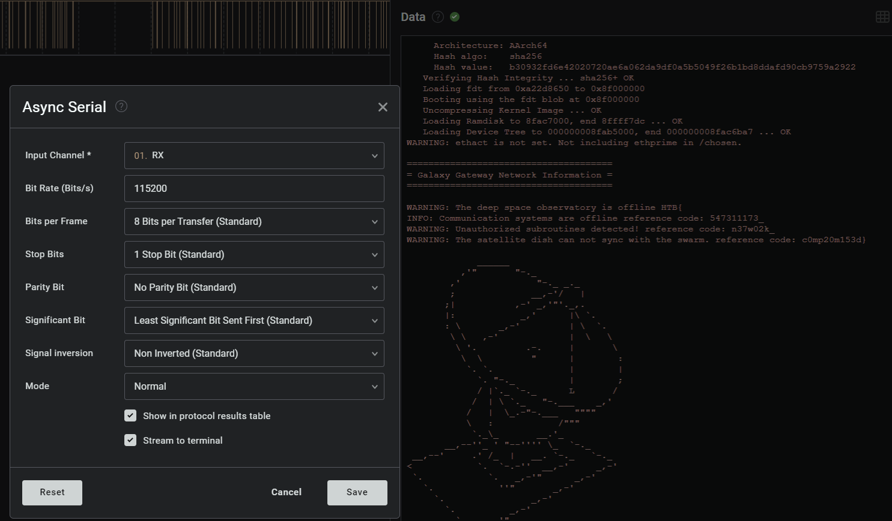
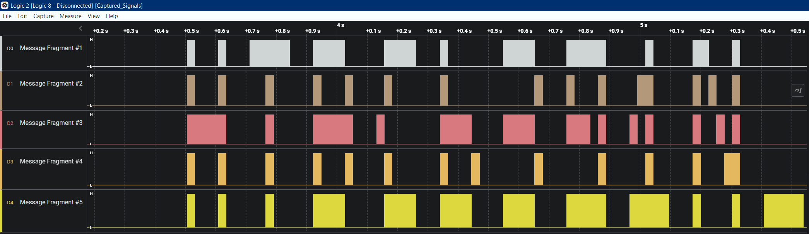

# HW

## Critical Flight

Open .gbr files in your favorite Gerber viewer - HadesMicro-B_Cu.gbr & HadesMicro-In1_Cu.gbr contain the flag.



> HTB{533_7h3_1nn32_w02k1n95_0f_313c720n1c5#$@}

## Debug

Open hw_debug.sal in Logic 2 analyzer.
Select RX -> Analyzers -> Async Serial -> 115200 bad rate and open terminal view.

Flag is close to end of the text:

```text
WARNING: The deep space observatory is offline HTB{
INFO: Communication systems are offline reference code: 547311173_
WARNING: Unauthorized subroutines detected! reference code: n37w02k_
WARNING: The satellite dish can not sync with the swarm. reference code: c0mp20m153d}
```

> HTB{547311173_n37w02k_c0mp20m153d}

## Timed Transmission

Probably the easiest task - just open Captured_Signals.sal in Logic 2 analyzer.


> HTB{b391N_tH3_HArdWAr3_QU3St}

